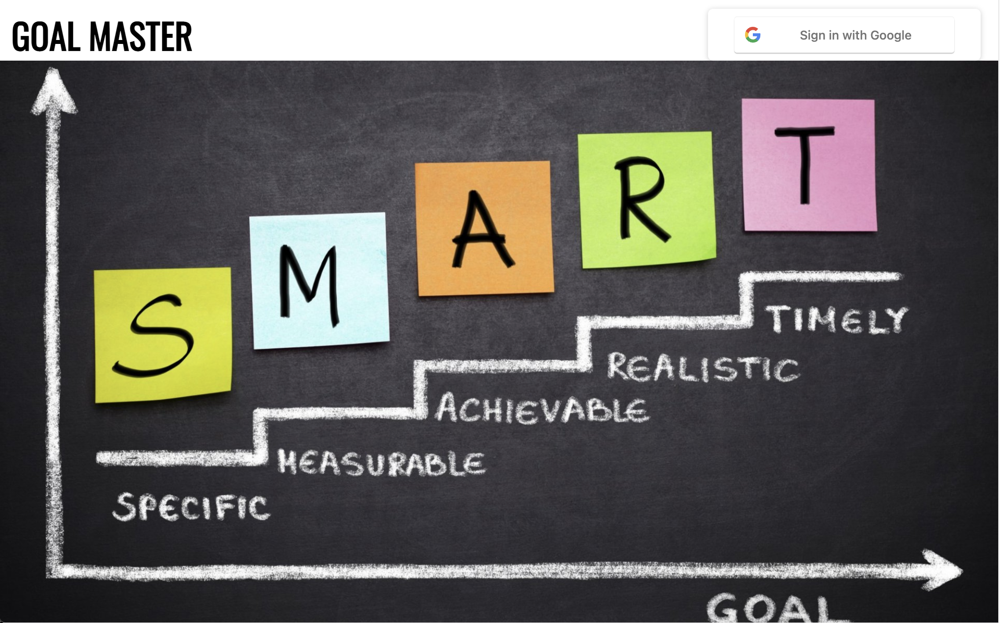
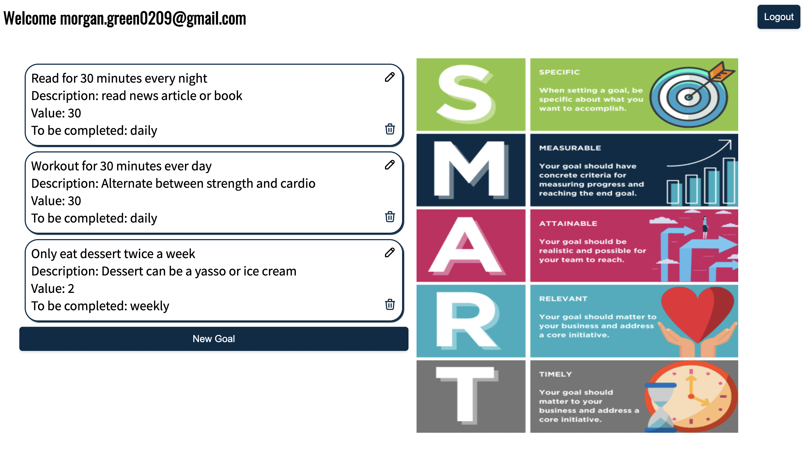

# GoalMaster

The best way to accomplish goals is to quantify them and make them as specific as possible. GoalMaster is a user-friendly application which allows users to make an individual account to document goal progress. It provides information on your goal, a description to make further specifications, a quantifiable value, and the occurrence of how often you will be completing this goal.


## Screenshots




## Tech Stack

**Client:** React, CSS, Firebase User Authentication

**Libraries:** Axios, React-Icons

**Server:** Node, Express, MongoDB


## Wireframe React Component Hierarchy, and ERD
- [Wireframe](https://drive.google.com/file/d/1CbcV0lFn5kBq7OFwvQZk8LXhSLZocICJ/view?usp=sharing)
- [Component Hierarchy](https://drive.google.com/file/d/1Nuzjx3bRhiAJBi5RNole-_YCfYAehJqG/view?usp=sharing)
- [ERD](https://drive.google.com/file/d/1wWpyE8zzN7v-kJCC8sSNciyJMQvb3BHY/view?usp=sharing)
## MVP Goals
- Have a login and signup using firebase authentication
- Have a main page to view goals
- Create new goals
- API of success quotes
- Edit goals
- Delete goals


## Post MVP Goals
- Have motivational quotes above the goals
- Light and dark mode option for users
- Data visualization for value completed for each goal(D3 or Recharts)

## Components

| Component    | Description                                                              |
| ------------ | ------------------------------------------------------------------------ |
| App          | Contains Google Firebase sign in, transition to main page when user is signed in |
| MainPage     | Welcomes the user, displays the goals page, and provides a logout button                         |
| Goal    | Provides a list of all the goals created by the user. Allows user to create, edit, and delete goals           |
| AddGoal      | Modal that appears when the user wants to create a new goal                            |
| EditGoal     | Modal that appears when the user wants to edit goals                      |
| Graph        | Displays time series data                                                |
| firebase-config | Firebase configuration                                     |
                           
## Time Frames


| Component        | Priority | Estimated Time | Time Invested | 
| ---------------- | -------- | -------------- | ------------- | 
| Firebase | H        | 8 hours        | 20 hours       | 
| Goals to appear      | H        | 4 hours      | 4 hour        | 
| Creating Goals            | H        | 2 hours        | 2 hour        | 
| Editing Goals         | H        | 2 hours        | 6 hour        | 
| Deleting Goals         | H        | 1 hours        | 3 hours       | 
| Backend Database seeded      | H        | 2 hours        | 4 hours       | 
| Backend Database setup        | H        | 6 hours        | 10 hours       |

## Code Snippet
```
const signInWithGoogle = () => {
    signInWithPopup(auth, googleProvider).then((result) => {
          sessionStorage.setItem('Auth Token', result._tokenResponse.refreshToken)
          sessionStorage.setItem('ID Token', result._tokenResponse.idToken)
          const header = { headers: { authorization: `bearer ${sessionStorage.getItem('ID Token')}`,
          'Accept': 'application/json',
          'Content-Type': 'application/json'} }
          fetch(`https://goalmaster.herokuapp.com/api/users/${result.user.email}`, header)
          .then((response) => {
            if (!response.ok) {
              fetch('https://goalmaster.herokuapp.com/api/users/', {
                headers: { 'authorization': `bearer ${sessionStorage.getItem('ID Token')}`,
                'Accept': 'application/json',
                'Content-Type': 'application/json'},
              method: "POST",
              body: JSON.stringify({
                email: result.user.email,
                goals: []
          })}).then((response) => {
            console.log(response)
          })
```
## Backend Repo and Deployed Site
- [Backend Repo](https://github.com/mgreen1092/goalmaster-backend.git)
- [Backend Deployed Link](https://goalmaster.herokuapp.com/api/users)
- [Deployed Frontend](https://goalmaster-frontend-21pq3xp4o-mgreen1092.vercel.app/)
## Issues and Resolutions

- Issue: When editing a goal, I needed to find the ID of the selected goal to initiate the appropriate axios call. When I was selecting the goal, it registered the goal, but everything would disappear on the screen based on how the function was set up.
    - Resolution: I used conditional rendering to say that if a goal is selected, the edit goal modal would appear. This allowed the MainPage to render if a goal was not selected.

- Issue: I needed to set users if they have never signed in to the app before since the goals are associated with users in the database. The google firebase authentication automatically signs them in, whether or not they have previously signed in before. Once the conditional flow was set up, I attempted to do an axios call to determine if a user was already in the database or not. If they weren't in the database, there would be a post axios request. However, the axios request was not returning an error.
    - Resolution: To resolve this, I used fetch instead of an axios call.
## Future Plans
- My database also incorporates a tracker to input how often you are completing your goals and to help measure if you are meeting the goal value users set for themselves. I plan to make an additional page when selecting on the goals you can input a value relating to the goal which will them get stored in the tracker. This data will be shown on a graph to have a better visual representation of users progress.
- I also would like to incorporate an API with inspirational quotes which appear above the users goals to help keep users motivated to come back and continue working towards their goals. 
